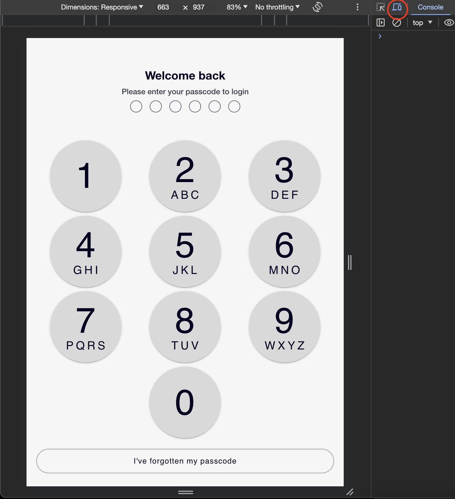
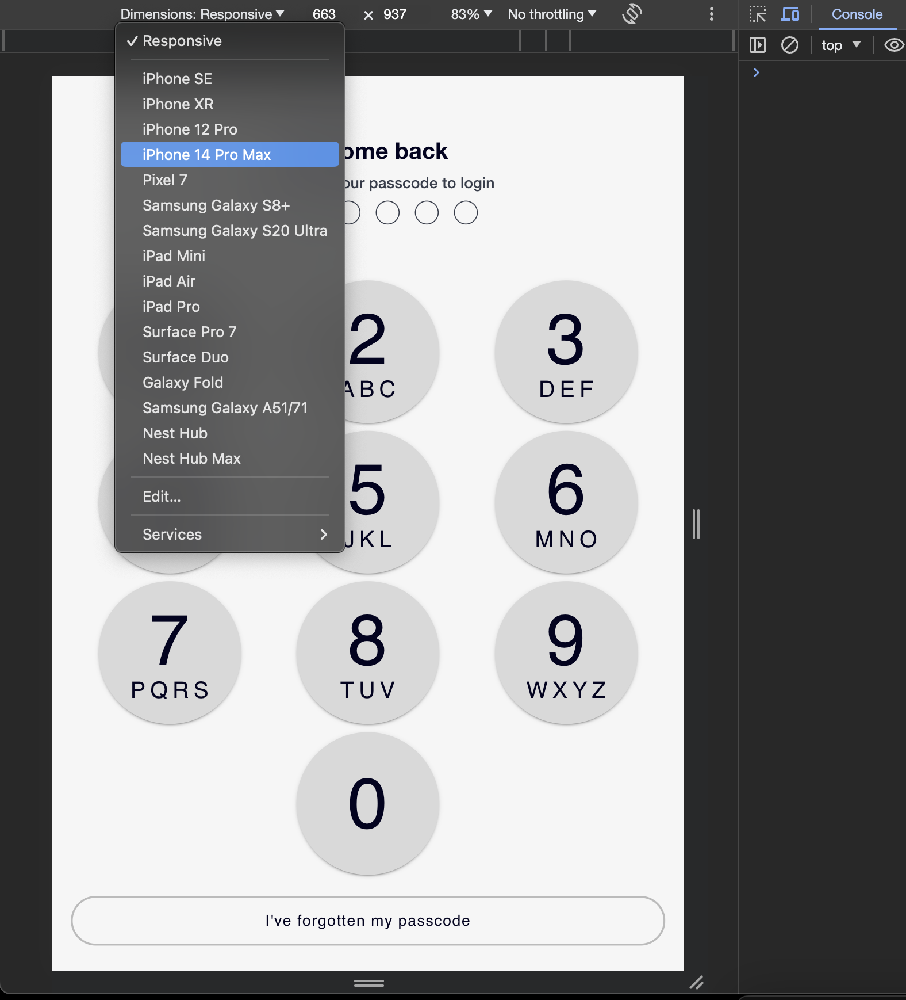
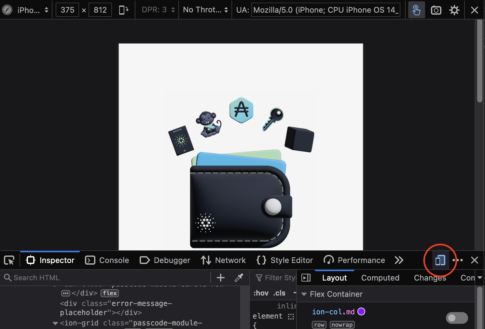
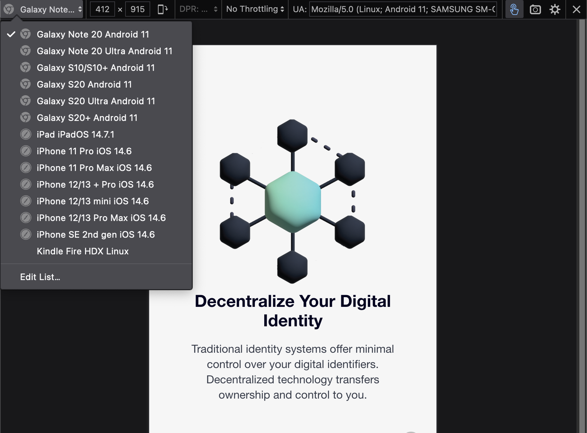

<div align="center">
  
  <hr />
    <h1 align="center" style="border-bottom: none">Cardano Foundation | Identity Wallet</h1>


  <hr/>
</div> 

# Disclaimer

<div align="justify"> 
<b>  Please be aware that your access to and use of the Open-Source Identity Wallet, including any content you may encounter, is subject to your own discretion and risk. Currently, the identity wallet is under-development and security audits have yet to be conducted. It is essential to understand, this version of the identity wallet does not currently feature encryption-at-rest, nor does it offer robust recovery or backup solutions.</b>
</div>
<br>
<div align="center">   
 <b> :warning: :warning: :warning: The Open-Source Identity Wallet is provided to you on an "as is" and "as available" basis. :warning: :warning: :warning: </b>
</div>
<br>
<div align="justify">    
<b> While we strive for high functionality and user satisfaction and endeavour to maintain reliability and accuracy, unforeseen issues may arise due to the experimental nature of this product. For detailed information on the terms and conditions that govern your use of the Open-Source Identity Wallet, we encourage you to read our Terms of Use. </b>
</div>

<br>

# Overview

<div align="justify"> 
The Identity Wallet is an open source application developed by the Cardano Foundation.  This project is the result of ongoing research and development pertaining to the principles of Self-Sovereign Identity (SSI), Decentralized Identifiers (DIDs), Self-Certifying Identifiers (SCIs), Verifiable Credentials, Verifiable Data Registries (VDRs) and the standards, frameworks and implementations available within the Cardano ecosystem and externally.  The first release of Identity Wallet provides an open source reference implementation demonstrating W3C Decentralized Identifiers, Verifiable Credentials, and Key Event Receipt Infrastructure (KERI) on Cardano.
</div>

#### Click the image below to watch our overview video

<br>
<p align="center">
  <kbd>
    <a href="https://drive.google.com/file/d/1So8bW7dgprOFgKs8PQKQ7c8Sm1Kd8aWW/view?usp=sharing">
    
    </a>
  </kbd>
</p>
<br>

# Features

| **User Interface**    |  **Secure Storage**  |**Interoperability**   |  **Standards and Protocols** | **[Connections](https://www.w3.org/TR/vc-data-model/#roles) and Credential Issuance**  |     **SSI Agents**   |           
|----------------|---------------|---------------|----------------|---------------|----------------|
| :white_check_mark: Intuitive User Experience | :white_check_mark: Hardware Security Module (HSM) or Secure Enclave (SE) securely stores private key material | :white_check_mark: [Aries RFCs](https://github.com/hyperledger/aries-rfcs) | :white_check_mark: [Verifiable Credentials](https://www.w3.org/TR/vc-data-model/) | :white_check_mark: Holder-to-Holder | :white_check_mark: [Aries Framework](https://github.com/hyperledger/aries-framework-javascript)| 
| :white_check_mark:  Android and iOS support | :white_check_mark: Hierarchical Deterministic (HD) wallet, leverage BIP-39 mnemonic seed phrase for identity profiles|:white_check_mark: [W3C](https://www.w3.org/) | :white_check_mark: [Autonomic Identifier](https://weboftrust.github.io/WOT-terms/docs/glossary/autonomic-identifier) (AID)  | :white_check_mark: Issuer-to-Holder | :white_check_mark: [KERIA](https://github.com/cardano-foundation/keria) | 
|  | |:white_check_mark: [DIDComm](https://github.com/decentralized-identity/didcomm-messaging) | :white_check_mark: [ACDC](https://wiki.trustoverip.org/display/HOME/ACDC+%28Authentic+Chained+Data+Container%29+Task+Force) | :white_check_mark: [Credential Issuance Testing Tool](https://identity-wallet-credential-issuance-web-interface.vercel.app/)  | :white_check_mark: [Signify-TS](https://github.com/cardano-foundation/signify-ts) | 
|  | |:white_check_mark: [KERI on Cardano](https://github.com/cardano-foundation/cardano-backer) | |  | |

# Potential Future Developments

|**App Features**            |  **Identity Recovery**               |     **Identifiers**           |     **Verifiable Credentials**  |    **Communications** |   **Peer-to-Peer (P2P)** |  
|----------------|---------------|---------------|----------------|----------------|----------------|
| Bluetooth |  [Shamir Secret Sharing](https://en.wikipedia.org/wiki/Shamir%27s_secret_sharing)|  [did:webs](https://labs.hyperledger.org/labs/didwebs.html#:~:text=did%3Awebs%20extends%20the%20web,%2C%20X509%2C%20and%20certificate%20authorities.) |  [OID4vc](https://openid.net/sg/openid4vc/specifications/)| Messaging | [CIP-45](https://github.com/cardano-foundation/CIPs/pull/395) Support  | 
| Biometrics | On-chain Recovery | [did:keri](https://identity.foundation/keri/did_methods/)  | On-Chain Schemas | Social Recovery |  App Integration |
| NFC|  Local Encrypted|  | [AnonCreds](https://www.hyperledger.org/projects/anoncreds) | [DIDComm v2](https://identity.foundation/didcomm-messaging/spec/) | | 
|Aries Askar | Cloud-based |  | [Cheqd](https://cheqd.io/) | |  |


# Preview in your Browser

**Disclaimer: Try it now provides access to a preview version of the identity wallet in your browser.  This preview version is <ins>not intended</ins> to be used for any purposes other than previewing the application.**

To experience the mobile application within the browser, follow these instructions for accessing mobile-view:
1. Open the developer options by pressing the ``` F12 ``` key on your keyboard or by right-clicking anywhere on the page, then choose ``` Inspect ``` from the context menu.
2. To Switch to a mobile view:
    - Chrome:
        <details>
          <summary>Click on the icon in the top right corner, as shown in the image below.</summary>
          
        </details>
        <details>
          <summary>Click on <b>Dimensions</b> and select <b>iPhone 14 Pro Max</b>.</summary>
          
        </details>
    - Firefox:
        <details>
          <summary>Click on the icon in the upper right corner, as shown in the image below, then close the panel.</summary>
          
        </details>
        <details>
          <summary>Click on <b>Dimensions</b> and select <b>Galaxy Note 20</b>.</summary>
          
        </details>
<br>
<div align="center"> 
      <a href="https://cf-identity-wallet.vercel.app">👨‍💻 Preview the latest version of the Identity Wallet here 👩‍💻
</div>


# Architecture
<div align="center"> 
  <p>
    <a href="">
    
    </a>  
  </p>     
</div>
<br>


# User Flows
In this section, you'll find detailed PDF documents outlining the various user flows within our application. These user flows serve as comprehensive guides, illustrating the application's user journeys step-by-step. Please feel free to explore and gain insight into the following user flows:

<div align="center"> 
      <table border="0">
       <tr>
          <td><b style="font-size:30px" ><a href="https://drive.google.com/file/d/1L7ZdQytjQq_BOXP1AZzHM0OhLxt1xbNA/view?usp=sharing">Introduction</a></b></td>
          <td><b style="font-size:30px"><a href="https://drive.google.com/file/d/1vB9NoWJG2ok9HB89wlbS0fLbPjLavudl/view?usp=sharing">Onboarding</a></b></td>
          <td><b style="font-size:30px"><a href="https://drive.google.com/file/d/1NCexApVn-njVFmN6wBPiDN1oX0DzcvSn/view?usp=sharing">Login</a></b></td>
          <td><b style="font-size:30px"><a href="https://drive.google.com/file/d/1RxkB5zM-xXbh7WcSWu9u1xbBMRDg3q9i/view?usp=sharing">Identity</a></b></td>
          <td><b style="font-size:30px"><a href="https://drive.google.com/file/d/1bVZPUgKmfPuIOraqDUyMMj_Dz3GGmLG2/view?usp=sharing">Connections</a></b></td>
          <td><b style="font-size:30px"><a href="https://drive.google.com/file/d/18TfwGaLXSLxuaHjJlbAmkRnFF-2ktrFT/view?usp=sharing">Credentials</a></b></td>
          <td><b style="font-size:30px"><a href="https://drive.google.com/file/d/1akOEf1GRGvVd4vNcWFNF4KOox5iuXOnv/view?usp=sharing">Verify Options</a></b></td>
          <td><b style="font-size:30px"><a href="https://drive.google.com/file/d/1BDr2l8ptnsAdL2lAWf8x2-KwN48lqXVz/view?usp=sharing">Scan</a></b></td>
       </tr>
      </table>
</div>

<p align="center">
  <kbd> 
      
  </kbd>
</p>


# Getting Started

## Requirements
- Node.js: Version 18.16.0 or higher.
- npm: Compatible with the Node.js version.
- Xcode: For iOS emulation (latest version recommended).
- Android Studio: For Android emulation (latest version recommended).
- Capacitor: Version 4.8.1 (refer to package.json). For detailed environment setup, refer to the [Capacitor Environment Setup Guide](https://capacitorjs.com/docs/getting-started/environment-setup).
- Mobile Device: iOS or Android for running the app on physical devices.
- Docker (only required for running locally deployed WebRTC relay).

Ensure that your system meets these requirements to successfully use and develop the Identity Wallet application.

### Cloning the Repository

```bash
git clone https://github.com/cardano-foundation/cf-identity-wallet.git
cd cf-identity-wallet
```
## Deployment before Building the App
Our DIDComm over LibP2P implementation currently depends on a locally deployed WebRTC relay.
```
cd cf-identity-wallet
docker compose up -d
```
## Preparing the App
Before running the App, ensure that all dependencies are installed and the app is built properly. 
In the project root directory, run the following commands:
```bash
npm install
```
## Running in the Browser
```bash
npm run dev
```
## Running in an Emulator
### Building the App
```bash
npm run build
```
### Prepare Capacitor: This command will sync all changes to iOS and Android.
```bash
npm run build:cap
```
### Running on Xcode Emulator
- Install Xcode: Ensure you have the latest version of Xcode installed on your Mac.
- Open the iOS Simulator: Open Xcode, navigate to `Xcode > Open Developer Tool > Simulator`.
- Select the desired iOS Device: Choose an iOS device model from the simulator list.
- Run the Application: In your project directory, execute `npx cap open ios`. This will open your project in Xcode. From here, you can build and run the application on the selected simulator. 
As alternative, you can open the file `App.xcworkspace` directly in Xcode from `ios/App` folder. 

### Running on Android Studio Emulator
- Install Android Studio: Make sure you have the latest version of Android Studio.
- Setup Android Emulator: Open Android Studio, go to `Tools > AVD Manager` and create a new Android Virtual Device (AVD) or select an existing one.
- Run the Application: Navigate to your project directory and run `npx cap open android`. This will open your project in Android Studio. Build and run the application on your chosen emulator.
As alternative, you can open the folder `android` directly in Android Studio.

In addition to using the emulators, you can also run the identity wallet directly on a real mobile device, providing a more authentic user experience and testing environment.  This approach requires the device to be tethered via cable to your computer running Xcode and/or Android Studio and the developer options must be enabled.  For further instructions: [Xcode](https://developer.apple.com/documentation/xcode/running-your-app-in-simulator-or-on-a-device) and [Android Studio](https://developer.android.com/studio/run/device).

## End-to-End (E2E) Testing
### Pre-installed on local:

- [allure commandline](https://docs.qameta.io/allure-report/#_installing_a_commandline)
- Node.js and npm
- Appium installed locally (in case if @wdio/appium-service will not work as expected)
  - install appium e.g. ``` brew install appium ```
  - install driver for ios ``` appium driver install xcuitest ```
  - install driver for android ``` appium driver install uiautomator2 ```
  - install driver for chrome ``` appium driver install chromium ```
  - install driver for safari ``` appium driver install safari ```
- Android Emulator for [Samsung Galaxy S23 Ultra](https://developer.samsung.com/galaxy-emulator-skin/guide.html) is configured or iOS Simulator for [iPhone 15 Pro / 15 Pro Max](https://developer.apple.com/documentation/xcode/installing-additional-simulator-runtimes)
- Create .env file in your local root project folder with APP_PATH property with path to app build for chosen platform
```
# Android
# APP_PATH=<LOCAL_PATH/app-release-unsigned.apk>

# iOS
APP_PATH=<LOCAL_PATH/App.app>
```
### Test run in Local:

1. Install all packages locally
```
npm install
```
2. Run for chosen platform and phone e.g.:
- for all tests
```
npm run wdio:android:s23ultra
```
or
```
npm run wdio:ios:15promax
```
- for specific feature
```
npm run wdio:ios:15promax -- --spec ./tests/features/passcode.feature
```
- for specific scenario in feature you want to run it put a line number at which there is scenario title
```
npm run wdio:ios:15promax -- --spec ./tests/features/passcode.feature:18
```
- If there are issues with appium service run by WDIO, please start appium in terminal separately
- In case WDIO tests will not exit on its own kill the process yourself e.g. ``` pkill -9 -f wdio ```
3. Set ALLURE_RESULTS_DIR on your local
```
ALLURE_RESULTS_DIR=tests/.reports/allure-results
```
4. Generate allure report
```
allure generate $ALLURE_RESULTS_DIR -o tests/.reports/allure-report --clean
```
5. Open allure report
```
allure open tests/.reports/allure-report
```

# Contributing

All contributions are welcome! Please feel free to open a new thread on the issue tracker or submit a new pull request.
<br>
Please read [Contributing](CONTRIBUTING.md) in advance.  Thank you for contributing!

## Additional Documents
- [Code of Conduct](CODE_OF_CONDUCT.md)
- [Security](SECURITY.md)
- [Changelog](CHANGELOG.md)

# Resources

## W3C
<div align="left"> 
      <table border="0">
       <tr>
          <td><b style="font-size:30px" ><a href="https://www.w3.org/TR/did-core/">DID Core Specification</a></b></td>
          <td><b style="font-size:30px"><a href="https://www.w3.org/TR/did-spec-registries/">DID Methods Registry</a></b></td>
          <td><b style="font-size:30px"><a href="https://www.w3.org/TR/vc-data-model/">Verifiable Credentials Data Model</a></b></td>
          <td><b style="font-size:30px"><a href="https://www.w3.org/TR/vc-data-model-2.0/">Verifiable Credential V2</a></b></td>
       </tr>
      </table>
</div>

## KERI
<div align="left"> 
      <table border="0">
       <tr>
          <td><b style="font-size:30px" ><a href="https://keri.one/">Key Event Receipt Infrastructure</a></b></td>
          <td><b style="font-size:30px"><a href="https://keri.one/keri-resources/">Resources</a></b></td>
          <td><b style="font-size:30px"><a href="https://github.com/cardano-foundation/keria">KERIA</a></b></td>
          <td><b style="font-size:30px"><a href="https://github.com/cardano-foundation/signify-ts">Signify-TS</a></b></td>
          <td><b style="font-size:30px"><a href="https://github.com/cardano-foundation/cardano-backer">Cardano Backer</a></b></td>
       </tr>
      </table>
</div>

## Standards, Frameworks and Governance
<div align="left"> 
      <table border="0">
       <tr>
          <td><b style="font-size:30px" ><a href="https://github.com/hyperledger/aries-framework-javascript">Hyperledger Aries Framework</a></b></td>
          <td><b style="font-size:30px"><a href="https://veramo.io/">Veramo</a></b></td>
          <td><b style="font-size:30px"><a href="https://europeanblockchainassociation.org/ssi-frameworks-sdks-overview/">SSI Frameworks Overview</a></b></td>
          <td><b style="font-size:30px"><a href="https://www.gleif.org/en">Global Legal Entity Identifier Foundation (GLIEF)</a></b></td>
          <td><b style="font-size:30px"><a href="https://identity.foundation/">Decentralized Identity Foundation</a></b></td>
          <td><b style="font-size:30px"><a href="https://digital-strategy.ec.europa.eu/en/policies/eidas-regulation">eIDAS Regulation</a></b></td>
          <td><b style="font-size:30px"><a href="https://ec.europa.eu/digital-building-blocks/wikis/display/EBSI/Home">European Blockchain Services Infrastructure (EBSI)</a></b></td>
       </tr>
      </table>
</div>  

# Resources

## W3C
- [DID Core Specification](https://www.w3.org/TR/did-core/)
- [DID Methods Registry](https://www.w3.org/TR/did-spec-registries/)
- [Verifiable Credentials Data Model](https://www.w3.org/TR/vc-data-model/)
- [Verifiable Credential V2](https://www.w3.org/TR/vc-data-model-2.0/)

## KERI
- [Key Event Receipt Infrastructure](https://keri.one/)
- [Resources](https://keri.one/keri-resources/)
- [KERIA](https://github.com/cardano-foundation/keria)
- [Signify-TS](https://github.com/cardano-foundation/signify-ts)
- [Cardano Backer](https://github.com/cardano-foundation/cardano-backer)

## Standards, Frameworks and Governance
- [Hyperledger Aries Framework](https://github.com/hyperledger/aries-framework-javascript)
- [Veramo](https://veramo.io/)
- [SSI Frameworks Overview](https://europeanblockchainassociation.org/ssi-frameworks-sdks-overview/)
- [Global Legal Entity Identifier Foundation (GLIEF)](https://www.gleif.org/en)
- [Decentralized Identity Foundation](https://identity.foundation/)
- [eIDAS Regulation](https://digital-strategy.ec.europa.eu/en/policies/eidas-regulation)
- [European Blockchain Services Infrastructure (EBSI)](https://ec.europa.eu/digital-building-blocks/wikis/display/EBSI/Home)
