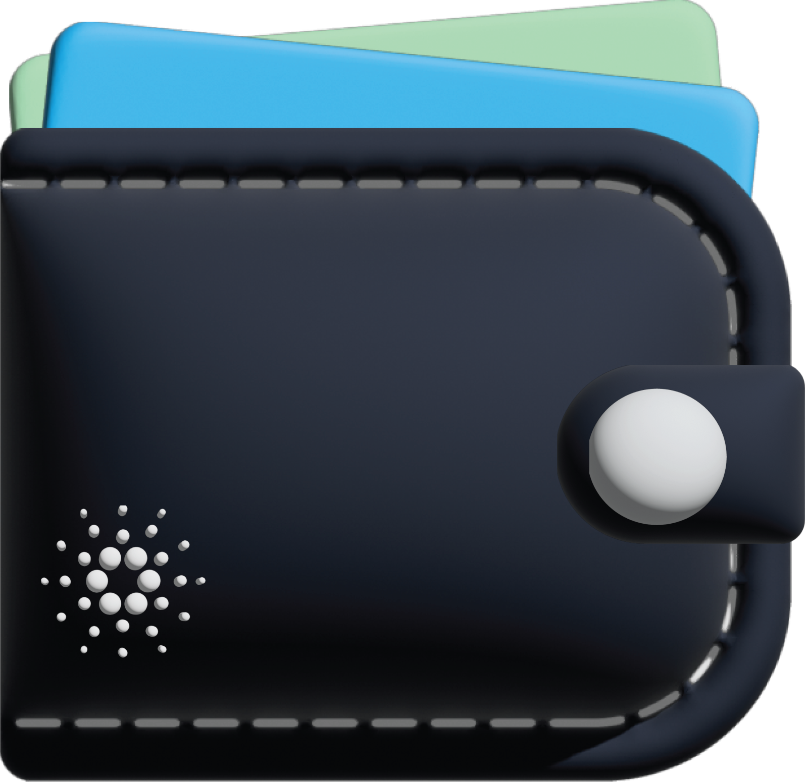

<div align="center">
  
  <hr />
    <h1 align="center" style="border-bottom: none">Cardano Foundation | Identity Wallet</h1>


  <hr/>
</div> 

# Disclaimer

<div style="text-align: justify">
<b>Please be aware that your access to and use of the Open-Source Identity Wallet, including any content you may encounter, is subject to your own discretion and risk. This wallet is a highly experimental mobile application and is not audited for security. It is essential to understand that the wallet does not currently feature encryption at rest, nor does it offer robust recovery or backup solutions. Given these limitations, we strongly advise against using your real Cardano seed phrase with this application. The Open-Source Identity Wallet is provided to you on an "as is" and "as available" basis. While we strive for high functionality and user satisfaction and endeavor to maintain reliability and accuracy, unforeseen issues may arise due to the experimental nature of this product. For detailed information on the terms and conditions that govern your use of the Open-Source Identity Wallet, we encourage you to read our Terms of Use. </b>
</div>

<br>

# Overview

<div style="text-align: justify">
The Identity Wallet is an open source application developed by the Cardano Foundation.  It provides a digital solution for users to securely store, manage, and share their identifiers and verifiable credentials using a mobile device.  This project is the result of on-going research and development pertaining to the principles of Self-Sovereign Identity (SSI), Decentralized Identifiers (DIDs), Self-Certifying Identifiers (SCIs), Verifiable Credentials, Verifiable Data Registries (VDRs) and the standards, frameworks and implementations available within the Cardano ecosystem and externally.  The release of Identity Wallet version #.#.#  provides an open source reference implementation demonstrating W3C Decentralized Identifiers, Verifiable Credentials, and Key Event Receipt Infrastructure (KERI) on Cardano.
</div>

<br>

<div style="position: relative; padding-bottom: 56.25%;">
  <iframe frameborder="0" width="100%" height="100%" allowfullscreen="" allow="autoplay" src="https://drive.google.com/file/d/1PQeVLkRwJj25Nspmtpr03z6X11JoKCz0/preview" style="width: 100%; height: 100%; position: absolute; left: 0px; top: 0px;"></iframe>
</div>

<br>

# Features

- Current Features
  - User-Friendly Interface
    - Intuitive UI/UX developed following proven design principles
    - Android and iOS supported
  - Secure Identity Storage
    - Identity Wallet leverages the Hardware Security Module (HSM) or Secure Enclave (SE) on the user’s mobile device to securely store private key material.
    - Identity Wallet is a Hierarchical Deterministic (HD) wallet,  users can leverage a BIP-39 mnemonic seed phrase for their Identity Wallet profile.
  - Interoperability
    - Identity Wallet is compliant and interoperable with the Aries RFCs
    - W3C
      - DID Methods
      - Verifiable Credentials
    - DIDComm v1 Mediator
    - KERI on Cardano
      - AID
      - ACDC
    - Global Legal Entity Identifier Foundation (GLIEF)
      - LEI 
      - vLEI
  - Identity Standards and Protocols
    - Identifiers
      - W3C Registered DID Methods
        - did:key
        - did:peer
      - KERI 
        - Autonomous Identifier (AID)
    - Verifiable Credentials
      - W3C
      - Autonomous Chained Data Container (ACDC)
  - Connections and Issuance Services
    - Connections 
      - Holder-to-Holder
      - Issuer-to-Holder
    - Issuance
      - Credential Issuance Testing Tool
        - W3C
        - ACDC
  - SSI Agents
    - Hyperledger Aries Framework
      - Aries Framework JavaScript (written in TypeScript)
    - KERI on Cardano
      - Signify
      - KERIA
      - Cardano Backer

- Potential areas of interest for future development
App Features
Bluetooth
Biometrics
NFC
Wipe Profile, Disaster Recovery, NFC
Identity Profile: 
Recovery
Shamir Secret Sharing
On-chain Recovery
Local Encrypted
Cloud-based
Identifiers
did:webs
did:keri


Verifiable Credentials
 OIDv4
On-chain Schemas
Connections
Secure Messaging
Social Recovery
Multi-sig
P2P
CIP-45 Support
D’App Identity Wallet Integration
DIDComm
Mediator v2
Development Workstreams
KERI on Chrome
Identity Wallet Extension
Cryptocurrency
Deep Links into existing wallets
Provide open source reference implementations
Bundle Transactions
Multi-sig


# Preview in your browser

**Disclaimer: Try it now provides access to a preview version of the identity wallet in your browser. This preview version is <ins>not intended</ins> to be used for any purposes other than previewing the application.**

Access the latest version of the Identity Wallet application [here](https://cf-identity-wallet.vercel.app).

To experience this app like it was designed for smarthpones, you can follow this structions:
1. Open the developer options by pressing the ``` F12 ``` key on your keyboard or by right-clicking anywhere on the page, then choose ``` Inspect ``` from the context menu.
2. To Switch to a mobile view:
    - Chrome: 
        - Click on the icon in the top right corner, as shown in the image below.
        
        - Click on ``` Dimensions ``` and select ``` iPhone 14 Pro Max ```.
        
    - Firefox: 
        - Click on the icon in the upper right corner, as shown in the image below, then close the panel.
        
        - Click on ``` Dimensions ``` and select ``` Galaxy Note 20 Android 11 ```.
        

# User Flow


# Getting Started

## Requirements
- Node.js: Version 18.16.0 or higher.
- npm: Compatible with the Node.js version.
- Xcode: For iOS emulation (latest version recommended).
- Android Studio: For Android emulation (latest version recommended).
- Capacitor: Version 4.8.1 (refer to package.json). For detailed environment setup, refer to the [Capacitor Environment Setup Guide](https://capacitorjs.com/docs/getting-started/environment-setup).
- Mobile Device: iOS or Android for running the app on physical devices.

Ensure that your system meets these requirements to successfully use and develop the Identity Wallet application.

### Cloning the Repository

```bash
git clone https://github.com/cardano-foundation/cf-identity-wallet.git
cd cf-identity-wallet
```

## Preparing the App
Before running the App, ensure that all dependencies are installed and the app is built properly. In the project root directory, run the following commands:
1. Install Dependencies:
```bash
npm install
```
2. Build the App:
```bash
npm run build
```
3. Prepare Capacitor:

This command will sync all changes to iOS and Android.
```bash
npm run build:cap
```

## Running in the Browser
```bash
npm run dev
```

## Running in an Emulator
### Running on Xcode Emulator
- Install Xcode: Ensure you have the latest version of Xcode installed on your Mac.
- Open the iOS Simulator: Open Xcode, navigate to `Xcode > Open Developer Tool > Simulator`.
- Select the desired iOS Device: Choose an iOS device model from the simulator list.
- Run the Application: In your project directory, execute `npx cap open ios`. This will open your project in Xcode. From here, you can build and run the application on the selected simulator. 
As alternative, you can open the file `App.xcworkspace` directly in Xcode from `ios/App` folder. 

### Running on Android Studio Emulator
- Install Android Studio: Make sure you have the latest version of Android Studio.
- Setup Android Emulator: Open Android Studio, go to `Tools > AVD Manager` and create a new Android Virtual Device (AVD) or select an existing one.
- Run the Application: Navigate to your project directory and run `npx cap open android`. This will open your project in Android Studio. Build and run the application on your chosen emulator.
As alternative, you can open the folder `android` directly in Android Studio.

In addition to emulator options, you can also run the wallet directly on a real mobile device, providing a more authentic user experience and testing environment.

## Deployment steps before building
Our DIDComm over LibP2P implementation currently depends on a locally deployed WebRTC relay.
```
cd cf-identity-wallet
docker compose up -d
```

## Building the app
TODO

## End-to-End (E2E) Testing
### Pre-installed on local:

- [allure commandline](https://docs.qameta.io/allure-report/#_installing_a_commandline)
- Node.js and npm 
- Android Emulator for Samsung Galaxy S23 Ultra is configured or iOS Simulator for iPhone 15 Pro / 15 Pro Max
- Add .env file ?? to root folder with APP_PATH property with path to app build for chosen platform e.g.
- Appium installed locally(in case if @wdio/appium-service will not work as expected)
```
# Android
# APP_PATH=<LOCAL_PATH/app-release-unsigned.apk>

# iOS
APP_PATH=<LOCAL_PATH/App.app>
```
### Test run in local:

1. Install all packages locally

```
npm install
```

2. Run tests for chosen platform and phone e.g.

```
npm run wdio:ios:15promax
```
or
```
npm run wdio:android:s23ultra
```
- If there are issues with appium service run by WDIO, please start appium in terminal separately
- In case WDIO tests will not exit on its own kill the process yourself e.g. ``` pkill -9 -f wdio ```

3. Set ALLURE_RESULTS_DIR on your local
```
ALLURE_RESULTS_DIR=tests/.reports/allure-results
```
4. Generate allure report
```
allure generate tests/.reports/allure-results -o tests/.reports/allure-report --clean
```

4. Open allure report
```
allure open tests/.reports/allure-report
```

## Generate icons

Install Capacitor [assets tool](https://capacitorjs.com/docs/guides/splash-screens-and-icons):
```
npm install @capacitor/assets --save-dev
```

Create a `assets` folder in the root directory with:
```
assets/
├── icon-only.png
├── icon-foreground.png
├── icon-background.png
├── splash.png
└── splash-dark.png
```

For iOS: 
```
npx @capacitor/assets generate --ios
```
For Android: 
```
npx @capacitor/assets generate --android
```

# Contributing

All contributions are welcome. Feel free to open a new thread on the issue tracker or submit a new pull request. Please read [CONTRIBUTING.md](CONTRIBUTING.md) first. Thanks!

## Additional Documents
- [CODE_OF_CONDUCT.md](CODE_OF_CONDUCT.md)
- [SECURITY.md](SECURITY.md)
- [CHANGELOG.md](CHANGELOG.md)

# Resources