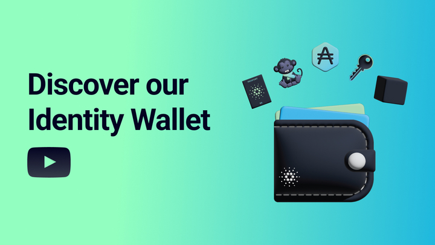

<div align="center">
  
  <hr />
    <h1 align="center" style="border-bottom: none">Cardano Foundation | Identity Wallet</h1>


  <hr/>
</div> 

# Disclaimer

<div align="justify"> 
<b> Please be aware that your access to and use of the Open-Source Identity Wallet, including any content you may encounter, is subject to your own discretion and risk. Currently, the identity wallet is under-development with security audits and threat modelling still pending. It is essential to understand, this version of the identity wallet does not currently feature encryption-at-rest, nor does it offer robust recovery or backup solutions. Furthermore, any seed phrase generated during the onboarding process is currently not being utilised. We are in the process of reviewing the ideal key management and social recovery methodologies for development in 2024. </b>
</div>
<br>
<div align="center">   
 <b>   :heavy_exclamation_mark:  The Open-Source Identity Wallet is provided to you on an "as is" and "as available" basis.  </b>
</div>
<br>
<div align="justify">    
<b> While we strive for high functionality and user satisfaction and endeavour to maintain reliability and accuracy, unforeseen issues may arise due to the experimental nature of this product. For detailed information on the terms and conditions that govern your use of the Open-Source Identity Wallet, we encourage you to read our Terms of Use. </b>
</div>

<br>

# Overview

<div align="justify"> 
<b> The Identity Wallet is an open source application developed by the Cardano Foundation. This project is the result of ongoing research and development pertaining to the principles of Self-Sovereign Identity (SSI), Self-Certifying Identifiers (SCIs), Verifiable Data Registries (VDRs), and the standards, frameworks, and implementations available within the Cardano ecosystem and externally. The first release of Identity Wallet provides an open source reference implementation demonstrating the Key Event Receipt Infrastructure (KERI) on Cardano. </b>
</div>

<br>
<p align="center">
  <kbd>
    <a href="https://www.youtube.com/watch?v=YmEJHQksFyE">
    
    </a>
  </kbd>
</p>

<div align="center">   
 <b>  Click the image to watch the overview video </b>
</div>

# Features

| **User Interface**    |  **Private Key Storage**  |  **Standards & Protocols** |  **SSI Services**   |           
|----------------|---------------|---------------|----------------|
|  Intuitive User Experience |  Hardware Security Module (HSM)   | [KERI](https://keri.one/) | [KERIA](https://github.com/cardano-foundation/keria) | 
|  Android  |  Secure Enclave (SE) | [ACDC](https://trustoverip.github.io/tswg-acdc-specification/) |  [Signify-TS](https://github.com/cardano-foundation/signify-ts) | 
| iOS |  | [CESR](https://weboftrust.github.io/ietf-cesr/draft-ssmith-cesr.html) |  [Credential Issuance Modules](https://identity-wallet-credential-issuance-web-interface.vercel.app/)  |   | 
|  |  | | [KERI on Cardano](https://github.com/cardano-foundation/cardano-backer) |


# Potential Future Developments

|**Mobile Application Features**        |  **Decentralized Identifier Recovery**               |     **Standards & Protocols**  |  **Peer-to-Peer (P2P)** |  
|----------------|---------------|----------------|----------------|
| Bluetooth |  [Shamir Secret Sharing](https://en.wikipedia.org/wiki/Shamir%27s_secret_sharing)| Ledger-based Schemas  | Private Messaging | 
| Biometrics | On-chain Recovery | Direct Mode (Offline) | Social Recovery |  App Integration |
| NFC|  Local Encrypted|  eIDAS 2.0  | [CIP-45](https://github.com/cardano-foundation/CIPs/pull/395) Support | 
|Aries Askar | Cloud-based | [OID4vc](https://openid.net/sg/openid4vc/specifications/)  | App Integration | 


# Preview in your Browser

**Disclaimer: This preview version is <ins>not intended</ins> to be used for any purposes other than previewing the application.**

To experience the mobile application within the browser, please select one of the following links below, depending on whether you are accessing the preview version on your desktop or mobile device.
<br>
<div align="center"> 
<p><u>🔗  Preview the latest version of the Identity Wallet on your browser 🔗 </u></p>
<br>
<p><a href="https://cf-identity-wallet.vercel.app/?browserPreview" target="_blank">* On a desktop computer</a></p>
<br>
<p><a href="https://cf-identity-wallet.vercel.app">* On a mobile phone</a></p>
</div>

# Architecture
<div align="center"> 
  <p>
    <a href="https://raw.githubusercontent.com/cardano-foundation/cf-identity-wallet/main/docs/images/readme/Architecture-Diagram.svg">
    
    </a>  
  </p>     
</div>
<br>


# User Flows
In this section, you'll find detailed PDF documents outlining the various user flows within our application. These user flows serve as comprehensive guides, illustrating the application's user journeys step-by-step. Please feel free to explore and gain insight into the following user flows:

<div align="center"> 
      <table border="0">
       <tr>
          <td><b style="font-size:30px" ><a href="https://drive.google.com/file/d/1L7ZdQytjQq_BOXP1AZzHM0OhLxt1xbNA/view?usp=sharing">Introduction</a></b></td>
          <td><b style="font-size:30px"><a href="https://drive.google.com/file/d/1vB9NoWJG2ok9HB89wlbS0fLbPjLavudl/view?usp=sharing">Onboarding</a></b></td>
          <td><b style="font-size:30px"><a href="https://drive.google.com/file/d/1NCexApVn-njVFmN6wBPiDN1oX0DzcvSn/view?usp=sharing">Login</a></b></td>
          <td><b style="font-size:30px"><a href="https://drive.google.com/file/d/1RxkB5zM-xXbh7WcSWu9u1xbBMRDg3q9i/view?usp=sharing">Identity</a></b></td>
          <td><b style="font-size:30px"><a href="https://drive.google.com/file/d/1bVZPUgKmfPuIOraqDUyMMj_Dz3GGmLG2/view?usp=sharing">Connections</a></b></td>
          <td><b style="font-size:30px"><a href="https://drive.google.com/file/d/18TfwGaLXSLxuaHjJlbAmkRnFF-2ktrFT/view?usp=sharing">Credentials</a></b></td>
          <td><b style="font-size:30px"><a href="https://drive.google.com/file/d/1akOEf1GRGvVd4vNcWFNF4KOox5iuXOnv/view?usp=sharing">Verify Options</a></b></td>
          <td><b style="font-size:30px"><a href="https://drive.google.com/file/d/1BDr2l8ptnsAdL2lAWf8x2-KwN48lqXVz/view?usp=sharing">Scan</a></b></td>
       </tr>
      </table>
</div>

<p align="center">
  <kbd> 
      
  </kbd>
</p>


# Getting Started

## Requirements
- Node.js: Version 18.16.0.
- npm: Compatible with the Node.js version.
- Xcode: For iOS emulation (latest version recommended).
- Android Studio: For Android emulation (latest version recommended).
- Capacitor: Version 4.8.1 (refer to package.json). For detailed environment setup, refer to the [Capacitor Environment Setup Guide](https://capacitorjs.com/docs/getting-started/environment-setup).
- Mobile Device: iOS or Android for running the app on physical devices.
- Docker (only required if running the credential server in Docker).

Ensure that your system meets these requirements to successfully use and develop the Identity Wallet application.

### Cloning the Repository

```bash
git clone https://github.com/cardano-foundation/cf-identity-wallet.git
cd cf-identity-wallet
```

## Preparing the App
This project uses a specific node version (check the requirements section above). You can optionally use [nvm](https://github.com/nvm-sh/nvm) to manage and switch between different Node.js versions on your computer.

Before running the App, ensure that all dependencies are installed and the app is built properly. 
In the project root directory, run the following commands:
```bash
npm install
```
## Running in the Browser
```bash
npm run dev
```
This command starts the development server and allows you to preview the application on your browser by opening this localhost address:

[http://localhost:3003/](http://localhost:3003/)

## Running in an Emulator
You can discover how to run the application in an emulator by following this [link](docs/Running-in-an-Emulator.md).

## End-to-End (E2E) Testing
You can gain additional insights into end-to-end testing by visiting the provided [link](docs/Testing.md).

# Contributing

All contributions are welcome! Please feel free to open a new thread on the issue tracker or submit a new pull request.


Please read [Contributing](CONTRIBUTING.md) in advance.  Thank you for contributing!

## Additional Documents
- [Code of Conduct](CODE_OF_CONDUCT.md)
- [Security](SECURITY.md)
- [Changelog](CHANGELOG.md)


# Troubleshooting
<div align="justify"> 
Please be aware that from time-to-time the hosted pre-production KERI services require restarting.  When this occurs it causes a white-screen when launching the application.  If you experience the white-screen issue please wait for the services to restart and the application will load as expected.   If you have any questions, there is also a Discord Channel available for the Identity Wallet.   
</div>

<br>

<div align="center"> 
      <a href="https://discord.gg/Wh25yBqwpz">👨‍💻 Join our Discord! 👩‍💻<a>
</div>


# Resources

## KERI
- [Key Event Receipt Infrastructure](https://keri.one/)
- [Resources](https://keri.one/keri-resources/)
- [KERIA](https://github.com/cardano-foundation/keria)
- [Signify-TS](https://github.com/cardano-foundation/signify-ts)
- [Cardano Backer](https://github.com/cardano-foundation/cardano-backer)

## Standards, Frameworks and Governance
- [SSI Frameworks Overview](https://europeanblockchainassociation.org/ssi-frameworks-sdks-overview/)
- [Global Legal Entity Identifier Foundation (GLIEF)](https://www.gleif.org/en)
- [Decentralized Identity Foundation](https://identity.foundation/)
- [eIDAS Regulation](https://digital-strategy.ec.europa.eu/en/policies/eidas-regulation)
- [European Blockchain Services Infrastructure (EBSI)](https://ec.europa.eu/digital-building-blocks/wikis/display/EBSI/Home)
