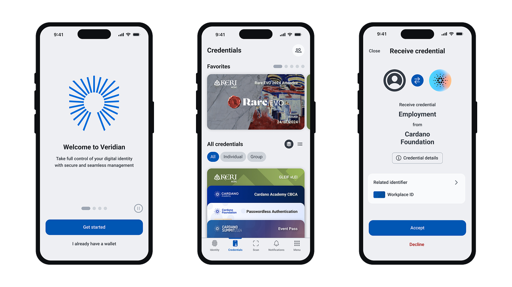

<div align="center">
  
  <hr />
  <h1 align="center" style="border-bottom: none">Veridian Wallet | Cardano Foundation</h1>


  <hr/>
</div>

# Overview

<div align="justify"> 
  <b>
    Veridian Wallet is an open source application developed by the Cardano Foundation.
    This project is the result of on-going research and development pertaining to the principles of Self-Sovereign Identity (SSI), Self-Certifying Identifiers (SCIs), Verifiable Data Registries (VDRs), and the standards, frameworks, and implementations available within the Cardano ecosystem and externally.
    The first release of the wallet provides an open source implementation demonstrating the Key Event Receipt Infrastructure (KERI) on Cardano.
    This wallet has undergone security auditing and penetration testing, and mitigations have been applied.
  </b>
</div>

<br>

<p align="center">
  <kbd> 
      
  </kbd>
</p>

<br>

Check out [our documentation](https://docs.veridian.id/) to learn how to use the app, connect to infrastructure and start developing with KERI!

# Features

- :iphone: Android & iOS Support with native biometrics
- :cloud: High messaging availability with a KERIA cloud agent
- :closed_lock_with_key: Secure Enclave (SE) / Trusted Execution Environment (TEE) usage for seeds & secrets
- :id: KERI autonomic identifiers
  - Securely backed by a combination of KERI native witnesses and Cardano
  - Single-sig, group multi-sig
- :ticket: ACDC credentials exchanged using the IPEX protocol
- :zap: Efficient over-the-wire communications using CESR encoding
- :desktop_computer: dApp integration using [CIP-45](https://cips.cardano.org/cip/CIP-0045)
  
 # Future Developments
 
- [Aries Askar](https://github.com/openwallet-foundation/askar) compatible encryption-at-rest to replace SQLCipher
- Social and multi-device identifier recovery
- P2P Chat
- Delegated multi-sig for organisational identity
- Cardano-backed ACDC verifiable credential schemas

# Standards & Protocols
- [Key Event Receipt Infrastructure (KERI)](https://keri.one/)
- [Trust Over IP - Authentic Chained Data Container (ACDC)](https://trustoverip.github.io/tswg-acdc-specification/)
- [Composable Event Streaming Representation (CESR)](https://weboftrust.github.io/ietf-cesr/draft-ssmith-cesr.html)

# SSI Services
- [KERIA Cloud Agent](https://github.com/cardano-foundation/keria)
- [Signify-TS Edge Client](https://github.com/cardano-foundation/signify-ts)
- [Verifiable Credential Testing Tool](https://cred-issuance-ui.dev.idw-sandboxes.cf-deployments.org/)
- [KERI on Cardano](https://github.com/cardano-foundation/cardano-backer)

# Getting Started

## Requirements
- Node.js: Version 20.
- npm: Compatible with the Node.js version.
- Xcode: For iOS emulation (latest version recommended).
- Android Studio: For Android emulation (latest version recommended).
- Capacitor: Version 7.0.0 (refer to package.json). For detailed environment setup, refer to the [Capacitor Environment Setup Guide](https://capacitorjs.com/docs/getting-started/environment-setup).
- Mobile Device: iOS or Android for running the app on physical devices.
- Docker, Docker Compose.

Ensure that your system meets these requirements to successfully use and develop the Identity Wallet application.

### Cloning the Repository

```bash
git clone https://github.com/cardano-foundation/veridian-wallet.git
cd veridian-wallet
make init # This will configure the git hooks
```

## Preparing the App
This project uses a specific node version (check the requirements section above). You can optionally use [nvm](https://github.com/nvm-sh/nvm) to manage and switch between different Node.js versions on your computer.

Before running the App, ensure that all dependencies are installed and the app is built properly. 
In the project root directory, run the following commands:
```bash
npm install
```
## Running in the Browser
The development server depends on a local KERIA and credential issuance server setup.
The [Docker Compose](./docker-compose.yaml) file can be used to quickly bring these services up.

```bash
docker-compose up -d --build
npm run dev
```
This command starts the development server and allows you to preview the application on your browser by opening this localhost address:

[http://localhost:3003/](http://localhost:3003/)

## Running in an Emulator
You can discover how to run the application in an emulator by following this [link](docs/Running-in-an-Emulator.md).

## End-to-End (E2E) Testing
You can gain additional insights into end-to-end testing by visiting the provided [link](docs/Testing.md).

## Additional Tutorials
- [Customizing Splash Screens and Icons](docs/Customizing-Splash-and-Icons.md)

# Contributing

All contributions are welcome!
Please feel free to open a new thread on the issue tracker or submit a new pull request.

Please read [Contributing](CONTRIBUTING.md) in advance.
Thank you for contributing!

## Additional Documents
- [Code of Conduct](CODE_OF_CONDUCT.md)
- [Security](SECURITY.md)
- [Changelog](CHANGELOG.md)


# Troubleshooting
<div align="justify"> 
If you encounter any issues or have questions, please drop us a message on our Discord channel. We are here to help!
</div>

<br>

<div align="center"> 
      <a href="https://discord.gg/Wh25yBqwpz">👨‍💻 Join our Discord! 👩‍💻<a>
</div>


# Resources

## KERI
- [Key Event Receipt Infrastructure](https://keri.one/)
- [Resources](https://keri.one/keri-resources/)
- [KERIA](https://github.com/cardano-foundation/keria)
- [Signify-TS](https://github.com/cardano-foundation/signify-ts)
- [Cardano Backer](https://github.com/cardano-foundation/cardano-backer)

## Standards, Frameworks and Governance
- [SSI Frameworks Overview](https://europeanblockchainassociation.org/ssi-frameworks-sdks-overview/)
- [Trust over IP](https://trustoverip.org/)
- [Global Legal Entity Identifier Foundation (GLIEF)](https://www.gleif.org/en)
- [vLEI ISO Standardization](https://www.gleif.org/media/pages/newsroom/press-releases/iso-standardizes-gleif-s-pioneering-digital-organizational-identity-offering-with-publication-of-vlei-technical-standard/42372c4929-1740658674/2024-10-14_iso-standardizes-gleif-s-pioneering-digital-organizational-identity-offering-with-publication-of-vlei-technical-stand.pdf)


# License

<div align="justify">

This project was previously licensed under MPL-2.0 up until commit `49f9811c363bb1c05a5349d4aa3434793a1b3a39`.
It is now licensed under Apache 2.0. Any prior versions remain available under MPL-2.0.

Please also found our open source [attributions](./ATTRIBUTIONS.md).
</div>
